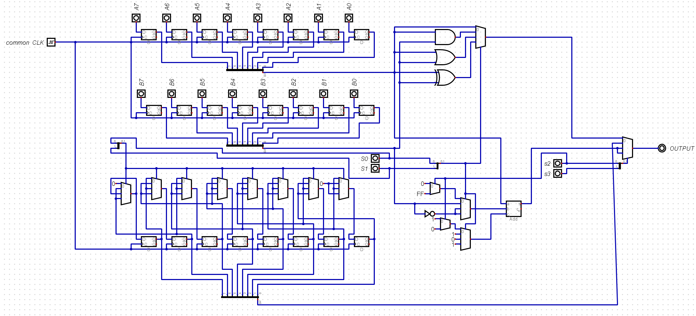

# Digital 8-Bit ALU Design

## Design Overview

This project presents the design of an 8-bit Arithmetic Logic Unit (ALU) using the Digital logic simulator.

The ALU is a key component in basic computer architecture, responsible for executing arithmetic, logical, and shift operations required for data processing.

The designed unit supports multiple operation modes selected through control inputs, demonstrating the core functionality of an ALU used in a basic computer system.

## Supported Operations

### Arithmetic Operations

- Transfer A
- A + 1
- A + B + 1
- A + B
- A - 1

### Logic Operations

- A + NOT B + 1
- A XOR B
- A XNOR B
- A OR B

### Shift Operations

- Logical Shift Right (LSHR A)
- Logical Shift Left (LSHL A)
- Arithmetic Shift Right (ASHR A)

